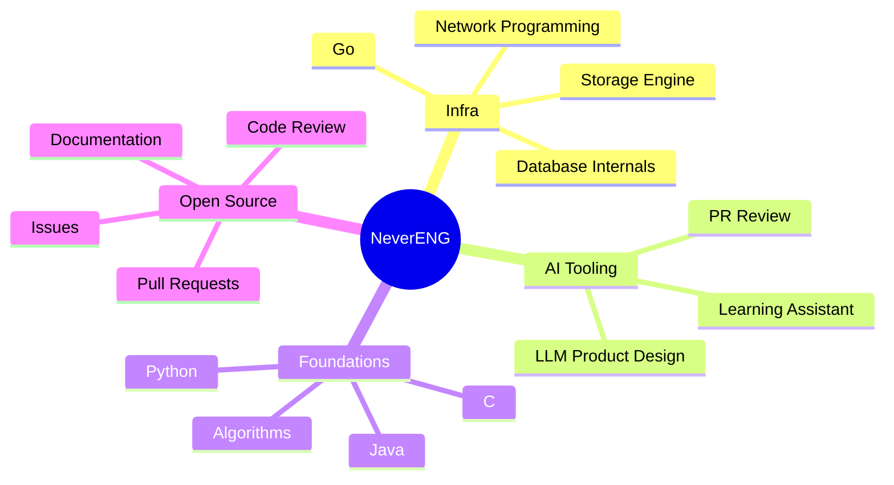

  

  

  

  
  
  
  
  
  
  

---
## Tech Stack

  

<table>
  <tr>
    <td><strong>Languages</strong></td>
    <td>Go, TypeScript, Java, Python, C, Rust, Markdown</td>
  </tr>
  <tr>
    <td><strong>Backend / Systems</strong></td>
    <td>Go services, storage-engine practice, TCP server basics, distributed-system reading</td>
  </tr>
  <tr>
    <td><strong>Frontend / Desktop</strong></td>
    <td>React, TypeScript, Vite, Tauri</td>
  </tr>
  <tr>
    <td><strong>AI Tooling</strong></td>
    <td>AI PR review experiments, learning assistant ideas, LLM-facing product design</td>
  </tr>
  <tr>
    <td><strong>Workflow</strong></td>
    <td>Git, GitHub PRs, issue tracking, docs, tests, code review</td>
  </tr>
</table>

## GitHub Dashboard

  
  

  

  

---

## PR & Contribution Level

  

| Track | Current Practice | Still Working On |
|---|---|---|
| Pull Requests | `71+` public PRs, mostly small steps | Cleaner changes, better tests, clearer review notes |
| Issues | `28+` public issues | Better reproductions and more useful technical context |
| Repositories | `14` public repos | Fewer scattered experiments, more maintained projects |
| Projects | BanDB / BanLea are current focus areas | Docs, examples, benchmarks, and steadier iteration |
| Code Review | Trying to understand review standards | Writing comments that are precise, kind, and actionable |

---

## Contribution Activity

  

<!--
Optional extra effect:
If this is used in the NeverENG/NeverENG profile repository, you can add a GitHub Action to generate a snake contribution SVG, then uncomment this block.

  

-->

---

## Current Quest

---

## Connect

  
  

  

